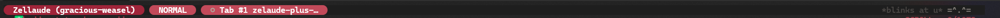

# Zellaude

A Zellij status bar plugin that replaces the default tab bar with real-time Claude Code and Codex activity awareness. This is an enhanced fork of [ishefi/zellaude](https://github.com/ishefi/zellaude) with additional features described below.



## Features

- **Full tab bar** — shows all Zellij tabs (not just Claude sessions), replacing the native tab bar
- **Session & mode display** — shows the Zellij session name and current input mode (NORMAL, LOCKED, PANE, etc.) with color-coded pill indicators
- **Live activity indicators** — see what every Claude Code / Codex session is doing at a glance; untracked tabs shown dimly
- **Dual agent support** — tracks both Claude Code and Codex agents independently per pane, with distinct color coding
- **Pane source fallback** — infers Claude/Codex panes from runtime pane metadata, so panes stay tracked even before the first hook event arrives
- **Clickable tabs** — click any tab to switch to it
- **Smart pane focus** — clicking a waiting (⚠) session focuses the exact pane so you can respond to the permission prompt immediately
- **Permission flash** — sessions pulse bright yellow for 2 seconds when a permission request arrives
- **Desktop notifications** — permission request notifications on macOS (via `terminal-notifier` or `osascript`) and Linux (via `notify-send`), rate-limited to once per 10s per tab
- **Elapsed time** — shows how long a session has been in its current state (after 30s), making it easy to spot stuck sessions
- **CWD display** — shows the current working directory leaf name inside each tracked tab
- **Buddy character** — an animated ASCII companion at the right edge of the bar with personality text (see [The Buddy](#the-buddy))
- **Multi-instance sync** — all Zellij tabs show a unified view of all sessions

### Activity symbols

| Symbol | Meaning |
|--------|---------|
| $\color{#b4afc3}{◆}$ | Session starting |
| $\color{#b48cff}{●}$ | Thinking |
| $\color{#ffaa32}{⚡}$ | Running Bash |
| $\color{#ffaa32}{◉}$ | Reading / searching files |
| $\color{#ffaa32}{✎}$ | Editing / writing files |
| $\color{#ffaa32}{⊜}$ | Spawning subagent |
| $\color{#ffaa32}{◈}$ | Web search / fetch |
| $\color{#ffaa32}{⚙}$ | Other tool |
| $\color{#50c878}{▶}$ | Waiting for user prompt |
| $\color{#ff3c3c}{⚠}$ | Waiting for permission |
| $\color{#50c878}{✓}$ | Done |
| $\color{#b4afc3}{○}$ | Idle |

### Settings

Click the **Zellaude** prefix on the left side of the bar to open the settings menu. Click it again (or the `×` button) to close. Settings are persisted to `~/.config/zellij/plugins/zellaude.json`.

| Setting | Options | Default | Description |
|---------|---------|---------|-------------|
| Notifications | Always / Unfocused / Off | Always | Desktop notifications on permission requests. "Unfocused" only notifies when the requesting pane is on a different tab. |
| Flash | Persist / Brief / Off | Brief | Yellow flash on permission requests. "Persist" keeps flashing until resolved, "Brief" flashes for 2 seconds. |
| Elapsed time | On / Off | On | Show time since last activity (appears after 30s). |
| Mode indicator | On / Off | On | Show current Zellij input mode in the prefix pill (NORMAL, LOCKED, PANE, etc.). |
| CWD | On / Off | On | Show the active session's current working directory (folder name) in each tracked tab. |
| Buddy | Off / Kaomoji / Cat | Off | Animated ASCII companion at the right edge of the bar. See [The Buddy](#the-buddy). |

## The Buddy

The Buddy is an optional animated ASCII character that lives at the far right of the status bar. It reacts to what your agents are doing in real time, with different faces and a small speech line to the left.

Enable it via the settings menu or via pipe command:

```bash
zellij pipe --name zellaude-buddy -- "kaomoji"  # or "cat", "off"
```

### Styles

**Kaomoji** — a sly coding coach. Cheers you on, but not without commentary.

```
   watching u code  (^-^)
        crunching.. (*_*)..
      this is fine. (o_o)...
       was never in doubt (^v^)
```

**Cat** — pure cat energy.

```
      purrrrr... =^.^=
       mrrrow... =^*^=
           MEOW!! =ToT=!!
        purr purr :3 =^v^=
```

### Activity states

| State | Kaomoji face | Cat face | Description |
|-------|-------------|----------|-------------|
| Idle | `(^-^)` / blink `(-_-)` | `=^.^=` / blink `=^-^=` | Ambient — slow blink every 4 seconds |
| Init | `(?_?)` | `=^o^=` | Session starting up |
| Thinking | `(*_*)` → `(o_o)...` | `=^*^=` → `=^*^=...` | Animated dots grow as reasoning continues |
| Tool | `(>v<)` | `=^>=` | Executing a tool |
| Prompting | `(~_~)` | `=^,^=` | Waiting for your next message |
| Waiting | `(>_<)` → `(TwT)!!!` | `=ToT=` → `=ToT=!!!` | Permission needed — escalates urgently |
| Done | `(^v^)` | `=^v^=` | Task complete |
| Agent done | `(-v-)` | `=^u^=` | Sub-agent returned |
| Notification | `(oAo)` | `=^!=` | Informational event |

Speech text rotates through variants every ~15 seconds for idle/static states and escalates with each animation frame for Thinking and Waiting.

## Install

### Prerequisites

- [Zellij](https://zellij.dev)
- [jq](https://jqlang.github.io/jq/) — used by the hook script at runtime
- [Rust + Cargo](https://rustup.rs) — required to build the WASM plugin
- `wasm32-wasip1` Rust target — the install script adds this automatically

### Build from source

```bash
git clone https://github.com/AG9898/zelaude-plus-plus.git
cd zelaude-plus-plus
./install.sh
```

This will:
1. Add the `wasm32-wasip1` Rust target if not already installed
2. Build the WASM plugin in release mode
3. Copy it to `~/.config/zellij/plugins/zellaude.wasm`
4. Register Claude Code hooks in `~/.claude/settings.json`
5. Register Codex hooks in `~/.codex/hooks.json` (if Codex is installed)

Then add the plugin to your Zellij layout to replace the default tab bar:

```kdl
default_tab_template {
    pane size=1 borderless=true {
        plugin location="file:~/.config/zellij/plugins/zellaude.wasm"
    }
    children
}
```

Or try the included layout directly:

```bash
zellij --layout layout.kdl
```

### Codex support

Codex hooks are installed automatically by `install.sh` if Codex is present. To install them manually after the fact:

```bash
./scripts/install-codex-hooks.sh
```

### Optional: desktop notifications

**macOS** — for click-to-focus support (focuses the right pane when you click the notification), install [terminal-notifier](https://github.com/julienXX/terminal-notifier):

```bash
brew install terminal-notifier
```

Without it, notifications still appear via `osascript` but clicking won't focus the pane.

**Linux** — install `notify-send` (usually part of `libnotify`):

```bash
# Debian/Ubuntu
sudo apt install libnotify-bin

# Arch
sudo pacman -S libnotify
```

## Uninstall

```bash
./install.sh --uninstall
```

This removes the plugin from `~/.config/zellij/plugins/` and de-registers all hooks from `~/.claude/settings.json` and `~/.codex/hooks.json`.

## How it works

Two components per agent type:

```
Claude Code hook → zellaude-hook.sh       → zellij pipe → plugin → render
Codex hook       → zellaude-codex-hook.sh → zellij pipe → plugin → render
```

1. **WASM plugin** — runs inside Zellij, receives events via `zellij pipe`, maintains all session state in memory, renders the status bar on each tick
2. **Hook scripts** — thin bash bridges that forward hook events (pre-tool, post-tool, permission request, stop, etc.) as JSON payloads to the plugin

The plugin determines the dominant activity across all active sessions and renders a unified view across every tab. All state lives in WASM memory — no temp files, no race conditions. Multiple plugin instances (one per Zellij tab) sync state automatically via inter-plugin messaging. Sessions are cleaned up automatically when tabs are closed.

Hook registration is version-tagged: re-running `install.sh` updates hooks in place without duplicating entries.

## License

MIT — see [LICENSE](LICENSE)
